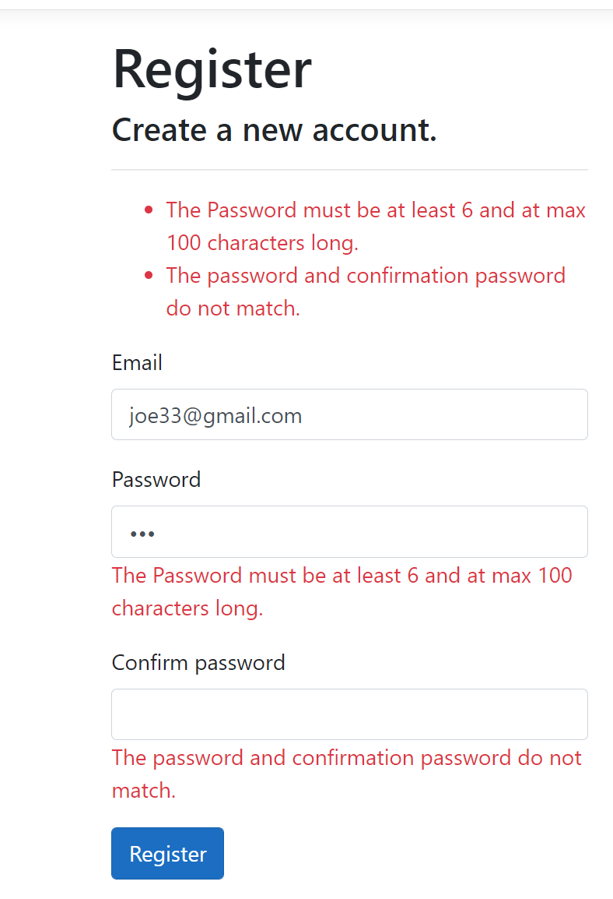
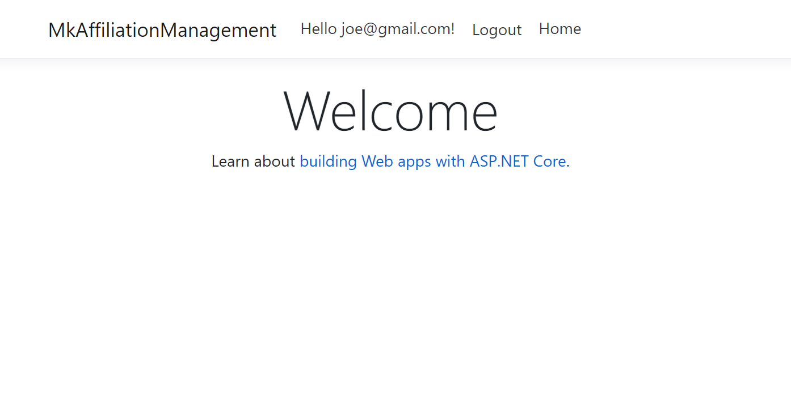
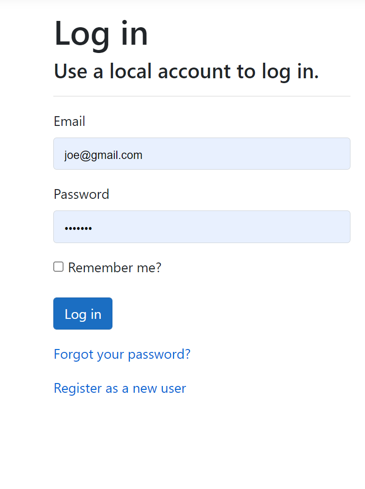
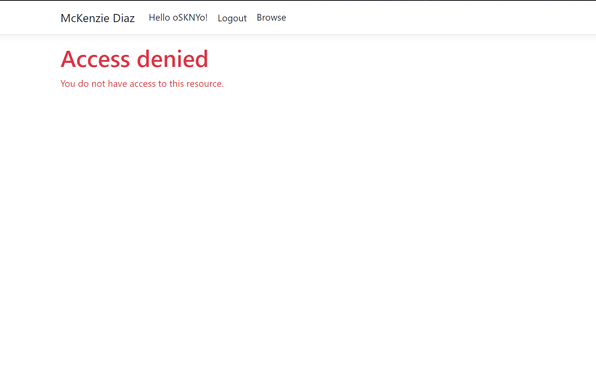
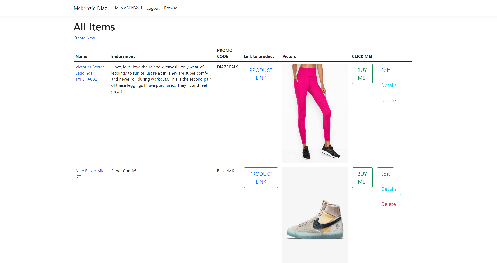
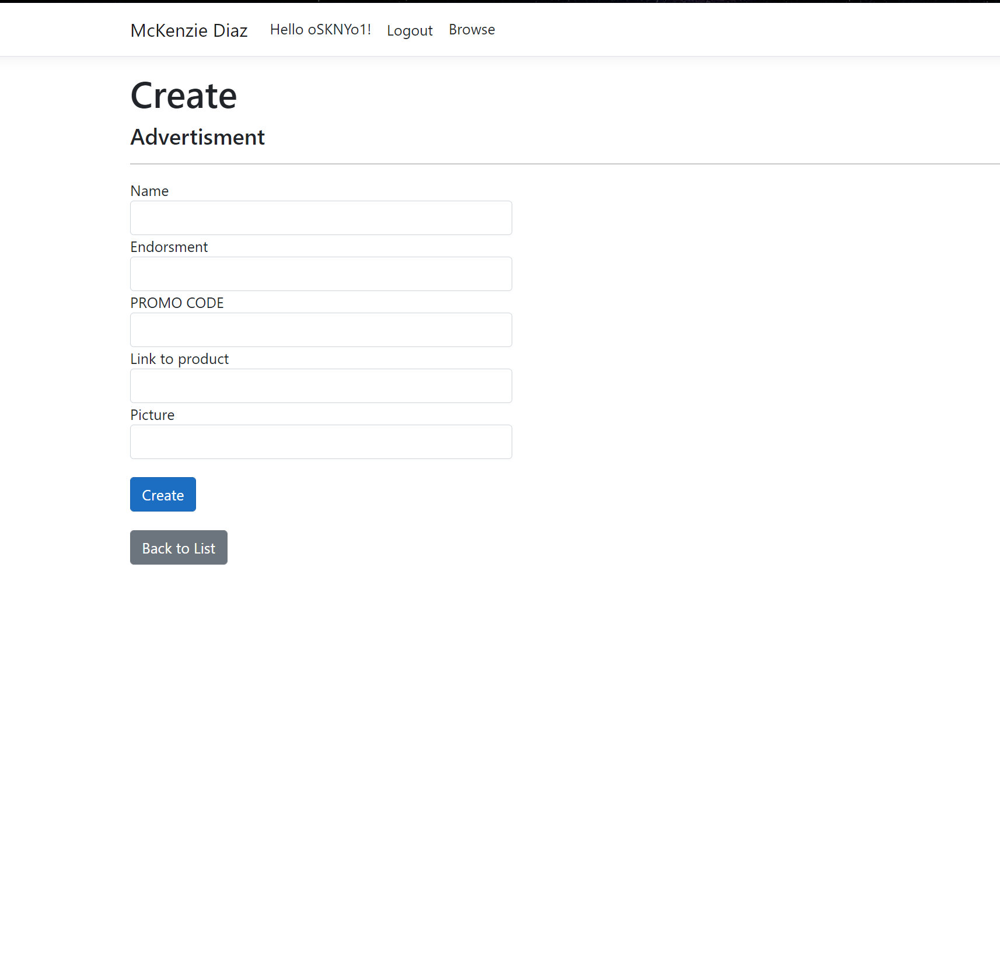
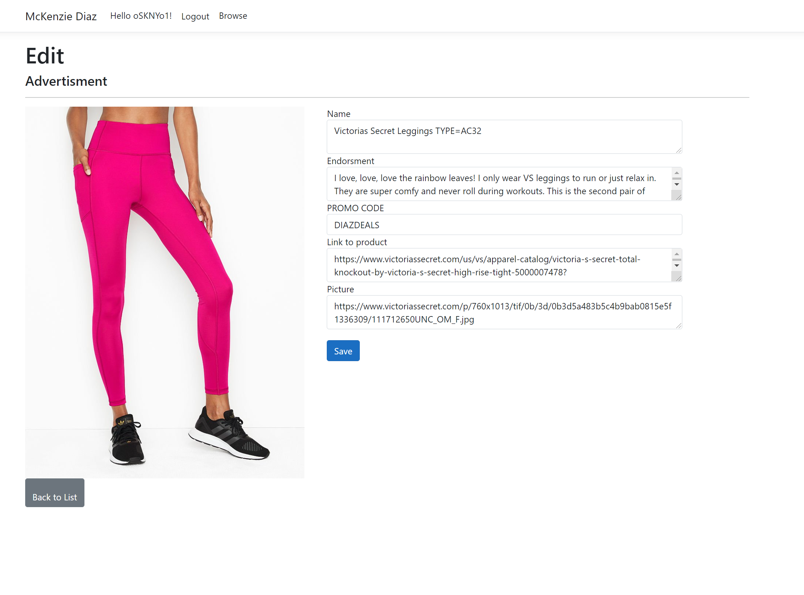
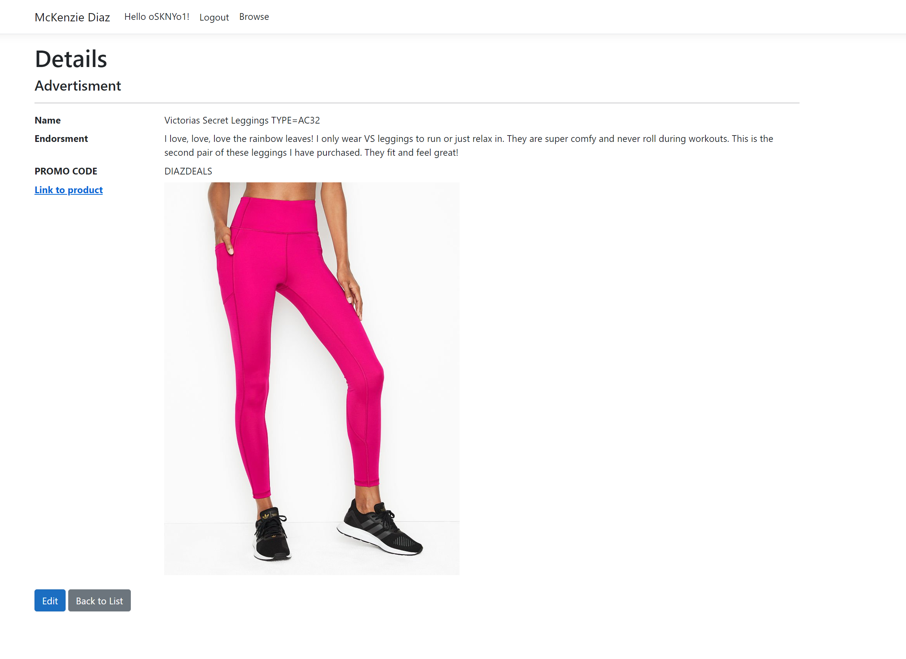

# Active Sponsors MKD
---------------------------------
---------------------------------

# Project MK-Products
---------------------------------

## Web Application

The web application consists of a frontend written in Razor views, HTML, CSS,
Bootstrap, Popper, and jQuery. The backend was written in C# using ASP.NET Core 3.1, Entity Framework Core, and the MVC framework.

When the user lands on the Home page of the website they will be greeted with an about me page where the social media influencer
will have input some information about themselves and their lifestyle and explain why the website they are on is important to them and their growth as a person.
There will be more information found on the homepage like information about business opportunities, Resume information, Affiliation information, and contact information
(maybe even just a "submit a ticket" section where any user can submit requests or thoughts for the purpose of business and networking)

After the user gets to know the social media influencer and trust/some sort of consumer relationship is formed, push users to browse products 
the social media influencer is sponsored with, and products the influencer endorses publicly. The user will be able to read about the product in a separate
catalog from the store page, and if they are interested in buying the product with the "PROMO CODE" to save money/support the influencer then there will be a BUY ME button
that links the user to the item and checkout page directly (Hopefully provided by the companies to the influencer when they are sponsored) where sales can be made to bring in
money for the social media influencer. The website will redirect traffic while informing them of products and serving them advertisements. 

Ideally, users come to the site, read about their influencers, read their endorsements, and then via inputting the promo code manually or clicking the buy me button
purchasing the item, hopefully increasing overall profit margins by at least 20-30% than prior to using this web app.


---------------------------------
## User Stories:
 - As an User I would like to be able to use an intuitive web app to purchase products that my favorite social media influencer use.
 - As an User I would like to be able to learn about my favorite social media influencer while browsing their products.
 - As an User I would like to be able to read endorsments left by the social media influencer detailing the viability and usefulness of a given product.
 - As an User I would like the web app to be simple and quick to use.
 - As an User i would like to opt into email updates and email verification for account creation

 - As a Developer I would like to have a secure back end database to secure the information inputed when creating new objects in the database.
 - As a Developer I would like to have Identity and Authorization in the app so an ADMIN page can be used to manage the website without developer interaction.
 - As a Developer I would like the app to have low load times, clean UX and UI, and a clear and concise reason for being on the website so theres no confusion for the user.
 - As a Developer I would like to handle as many user input errors as possible to avoid any server side crashes when creating new database entrys.
 - As a Developer I need to process the inputs given and edit them accordingly to fit the requirements of the database.
 - As a Developer I would like to complete Identity and Authorization within the next week. (9/18)
---------------------------------

## Tools Used
Microsoft Visual Studio Community 2017 (Version 15.5.7)

- C#
- ASP.Net Core
- Entity Framework
- MVC
- xUnit
- Bootstrap
- Azure

- Blob storage
- SendGrid


---------------------------------

## Recent Updates

#### V 1.4


---------------------------

## Getting Started

Clone this repository to your local machine.
```
$ git clone https://github.com/YourRepo/YourProject.git
```
Once downloaded, you can either use the dotnet CLI utilities or Visual Studio 2017 (or greater) to build the web application. The solution file is located in the AmandaFE subdirectory at the root of the repository.
```
cd YourRepo/YourProject
dotnet build
```
The dotnet tools will automatically restore any NuGet dependencies. Before running the application, the provided code-first migration will need to be applied to the SQL server of your choice configured in the /AmandaFE/AmandaFE/appsettings.json file. This requires the Microsoft.EntityFrameworkCore.Tools NuGet package and can be run from the NuGet Package Manager Console:
```
Update-Database
```
Once the database has been created, the application can be run. Options for running and debugging the application using IIS Express or Kestrel are provided within Visual Studio. From the command line, the following will start an instance of the Kestrel server to host the application:
```
cd YourRepo/YourProject
dotnet run
```


---------------------------------

## Usage
COMING SOON 
### Creating an account


### Home Page Greeting


### Login


### Authentication


### Overview of Recent Posts


### Creating a Post


### Enriching a Post


### Viewing Post Details


---------------------------
## Data Flow (Frontend, Backend, REST API)
COMING SOON
***[Add a clean and clear explanation of what the data flow is. Walk me through it.]***


---------------------------
## Data Model


### Overall Project Schema
COMING SOON
***[Add a description of your DB schema. Explain the relationships to me.]***


---------------------------
## Model Properties and Requirements

### Advertisment/Sponsorship product

| Parameter | Type | Required |
| --- | --- | --- |
| ID  | int | YES |
| ProductName | string | YES |
| ProductDescription | string | YES |
| ProductEndorsment | string | YES | 
| ProductImage | string | YES |
| ProductLink/ReferralLink | string | YES
| MEDIA? | string | NO


### User

| Parameter | Type | Required |
| --- | --- | --- |
| ID  | int | YES |
| Name | string | NO |
| Username | string | NO |
| Email	| string	| YES	|

### User Roles

| Parameter | Type | Required |
| ApplicationRoles | Admin | YES |
| ApplicationRoles | Member | YES |
---------------------------

## Change Log


- 1.0	| Edits Readme
- 1.1.0 | Creates Model classes, Sets up Schemas for Databases, Initializes Identity
- 1.1.1 | Initialization and handling of databases
- 1.1.2 | Customization of Identity/Roles
- 1.1.3 | Repository design pattern of Advertisment model and database
- 1.1.4 | Successful seeding of admin user in DB
- 1.2.0 | Working Identity with Roles authentication and authorization, cleaned UI, APP is functional.
- 1.2.1 | Adds Media to README, Cleans up UI
- 1.3.0 | Handing off to subcontractor for front end rehauld and feedback 


------------------------------

## Authors
Tanner Percival

------------------------------

More Coming Soon!
